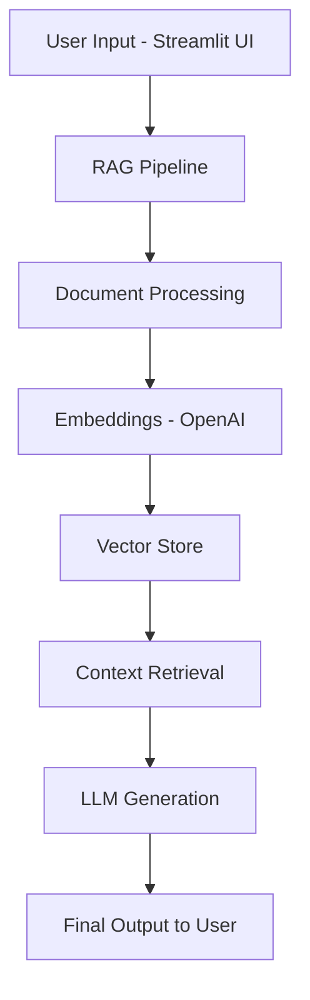

# 📊 AI Policy Briefing Assistant (RAG System)

A **Streamlit-based AI application** that uses **Retrieval-Augmented Generation (RAG)** to analyze policy documents and generate structured outputs such as summaries, briefings, and policy insights.

This project demonstrates how to integrate **LLMs, vector search, and document processing** into a functional end-to-end application.

---

## 🚀 Project Description

The **AI Policy Briefing Assistant** allows users to:

* Upload and process policy-related documents
* Ask natural language questions
* Generate context-aware responses grounded in source material

The system uses a **RAG pipeline** to improve accuracy and reduce hallucinations by retrieving relevant document content before generating responses.

---

## 🧠 How It Works



---

## 📂 Key Files in This Repository

### `app.py`

* Streamlit frontend for user interaction
* Handles:

  * File uploads
  * User queries
  * Displaying generated outputs
* Connects UI to the backend RAG pipeline

---

### `rag_pipeline.py`

* Core logic of the application
* Responsible for:

  * Processing user queries
  * Retrieving relevant document chunks
  * Passing context to the LLM

---

### `document_loader.py`

* Handles document ingestion and preprocessing
* Functions may include:

  * Loading PDFs / text files
  * Splitting documents into chunks
  * Preparing data for embedding

---

## 🛠️ Tech Stack

* **Python**
* **Streamlit** – UI layer
* **OpenAI API** – embeddings + LLM
* **Vector Store** – Pinecone or local

---

## 🔒 Note on Deployment

This repository contains the source code for the application.  
The Streamlit app is not publicly deployed.

To run locally:
1. Clone the repo  
2. Add your OpenAI API key  
3. Run: streamlit run app.py

---

## ⚙️ Setup Instructions

### 1. Clone the Repository

```bash
git clone https://github.com/mah6413/Policy-Briefing-Assistant.git
cd Policy-Briefing-Assistant
```

---

### 2. Install Dependencies

```bash
pip install -r requirements.txt
```

---

### 3. Set Environment Variables

Create a `.env` file or export:

```bash
OPENAI_API_KEY=your_api_key_here
PINECONE_API_KEY=your_api_key_here
PINECONE_ENV=your_env
```

---

### 4. Run the Application

```bash
streamlit run app.py
```

---

## 💡 Example Usage

1. Launch the Streamlit app
2. Upload a policy document
3. Enter a query such as:

   * *"Summarize the key recommendations"*
   * *"Generate a policy briefing"*
4. View AI-generated output grounded in document content

---

## 🎯 Use Cases

* Policy analysis
* Nonprofit research
* Legal and regulatory summarization
* Government and advocacy work

---

## 🧪 Current Capabilities

* End-to-end RAG pipeline
* Interactive document querying
* Context-aware response generation

---

## 🔮 Future Improvements

* Export outputs (PDF, Word, PPT)
* Source citation highlighting
* Multi-document comparison
* Authentication and deployment

---

## 👤 Author

**Maxine H.**

* Cybersecurity Analyst
* MBA – RIT
* MS in Business Analytics & Applied AI candidate at University of Rochester-Simon Business School

---

## ⭐ Why This Project Matters

This project demonstrates:

* Real-world **RAG system implementation**
* Integration of AI into **policy workflows**
* End-to-end system design (UI + backend + LLM)


